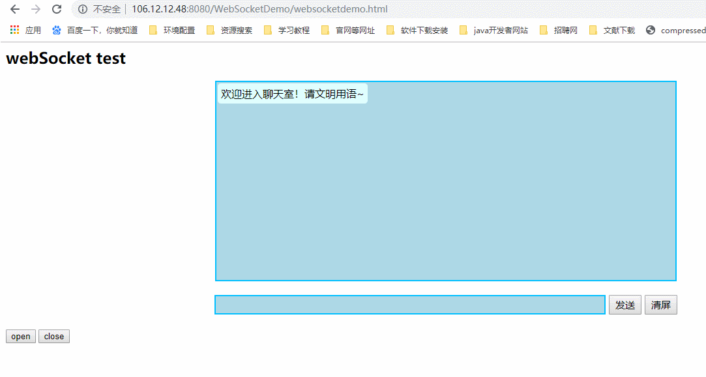
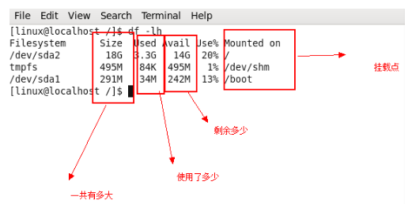
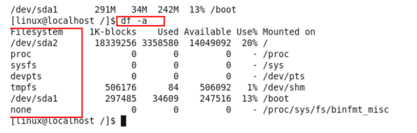
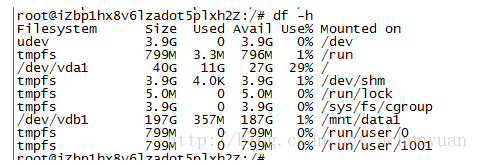
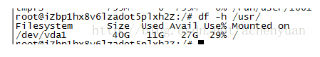
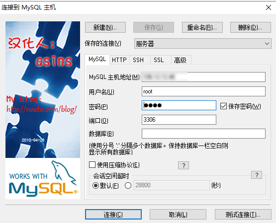

虚拟机



# 1、虚拟机 Ubuntu
## 1.1	用户

#### 1.1.1	创建用户

创建用户有两条命令：adduer 和  useradd，对应着两条删除用户的命令：deluser 和 userdel。 
这两种命令之间的区别： 

- adduser：会自动为创建的用户指定主目录、系统shell版本，会在创建时输入用户密码。 
- useradd：需要使用参数选项指定上述基本设置，如果不使用任何参数，则创建的用户无密码、无主目录、没有指定shell版本。

```shell
adduser username
```

```shell
useradd testuser  创建用户testuser
passwd testuser  给已创建的用户testuser设置密码
#说明：新创建的用户会在/home下创建一个用户目录testuser
usermod --help  修改用户这个命令的相关参数
userdel testuser  删除用户testuser
rm -rf testuser  删除用户testuser所在目录
```
#### 1.1.2	切换用户

```shell
# 从 root 用户切换到普通用户
su username

# 从普通用户切换到 root 用户
sudo su
```

#### 1.1.3	将用户添加到 sudoers 中

```shell
vi /etc/sudoers

root    ALL=(ALL)       ALL

# 按 yyp 键复制并在粘贴在下一行，在这一行的 root 替换为你所需要添加用户的账户名，比如 huddy，结果就是
root    ALL=(ALL)       ALL 
huddy  ALL=(ALL)       ALL

# 如果你希望之后执行sudo命令时不需要输入密码，那么可以形如
root    ALL=(ALL)       ALL 
huddy  ALL=(ALL)       NOPASSWD:ALL

# esc 输入:wqa!保存即可。

```


## 1.3	重启和关机

```shell
# 重启命令
reboot 
shutdown -r now 	# 立刻重启
shutdown -r 10 		# 过10分钟自动重启
shutdown -r 20:35 	# 在时间为20:35时候重启

# 如果是通过shutdown命令设置重启的话，可以用shutdown -c命令取消重启 

# 关机命令 
halt  				# 立刻关机（一般加-p 关闭电源）
poweroff 			# 立刻关机 
shutdown -h now 	# 立刻关机
shutdown -h 10 		# 10分钟后自动关机 

# 如果是通过shutdown命令设置关机的话，可以用shutdown -c命令取消关机
```

## 1.4	设置环境变量

### 1.4.1	临时设置

```shell
export PATH=/home/aoing/work/jre1.8.0_211/bin:$PATH
```

### 1.4.2	当前用户的全局设置

```shell
# 打开~/.profile，添加行
export PATH=/home/yan/share/usr/local/arm/3.4.1/bin:$PATH
# 或者直接使用 echo
echo 'export JAVA_HOME=/home/aoing/work/jre' >>.profile
echo 'export PATH=${JAVA_HOME}/bin:${PATH}' >>.profile
# 使生效
source .profile
```

### 1.4.3	所有用户的全局设置

```shell
$ vi /etc/profile

# 在里面加入
export PATH=/home/aoing/work/jre1.8.0_211/bin:$PATH
echo 'export JAVA_HOME=/root/jre1.8.0_211' >>/etc/profile
echo 'export PATH=${JAVA_HOME}/bin:${PATH}' >>/etc/profile

# 使生效
source profile
```

## 1.5	查找一个文件中的关键词

### 1.5.1	使用 cat

```
cat <filename> | grep "keyword"
```

不可以显示文件名，因为是将文件转成输入流传给 grep，再进行查找的

### 1.5.2	使用 find

```
find ./ -type f | xargs grep "keyword"
```

1. -type f 表示查找文件
2. 查找的结果再通过管道，送到 xargs 去处理, xargs 接收 stdin 的标准输入，再用 grep 过滤
3. find 来查找相对会慢些，因为是直接查找硬盘
4. 可以显示关键词所在的文件名

## 1.6	查看某一个端口号是否被占用的命令

```shell
# 1、查看端口使用情况（并没有LISTEN那一行，所以就表示没有被占用。此处注意，LISTENING 并不表示端口被占用，不要和 LISTEN 混淆，查看具体端口时候，必须要看到 tcp，端口号，LISTEN那一行，才表示端口被占用了）
netstat  -anp | grep 82 #查看82端口的使用情况

# 2、查看当前所有已经使用的端口
netstat -nultp
```

## 1.7	查看所有进程

```shell
ps -ef
```

## 1.8	如何查看可用内存

1. free 命令检查有关系统 RAM 使用情况的信息

   ```shell
   free -m
                 total        used        free      shared  buff/cache  available
   Mem:           1821        1034          78          3        708        523
   Swap:          2047          51        1996
   ```

2. vmstat 命令查看内存统计信息

   ```shell
   vmstat -s
   ```

3. /proc/meminfo 命令打印内存信息

   ```shell
    cat /proc/meminfo
   ```

4. top 命令用于打印系统的 CPU 和内存使用情况

5. htop 命令详细分析您的 CPU 和内存使用情况

## 1.9	查看磁盘使用情况

### 1.9.1	统计磁盘整体情况，包括磁盘大小，已使用，可用命令 `df`

1. 命令 `df -lh` 磁盘使用情况

  


2. 命令`df -a` 是全部的文件系统的使用情况

 


3. 查看当前目录 `df -h`，统计每个目录下磁盘的整体情况

  


4. 查看指定目录，在命令后直接放目录名，比如查看 “usr” 目录使用情况：`df -h /usr/`，统计了指定目录一使用情况，及分配的最大空间

   


### 1.9.2	具体查看文件夹的占用情况

1. 查看当前目录每个文件夹的情况 `du --max-depth=1 -h`
2. 查看指定目录每个文件夹的情况，命令后直接根目录名 `du --max-depth=1 -h /usr/`

### 1.9.3	计算文件夹大小

1. 查看目录整体占用大小 `du -sh`
2. 查看指定目录整体占用大小，命令后直接根目录名 `du -sh /usr/`

## 1.10	查看内核版本

```
uname -a

cat /proc/version
```

# 2、Docker

注意：如果出错，首先考虑一下文件的权限，修改文件权限如下

```shell
sudo chmod 755 文件名
```

## 2.1	Docker 相关命令

### 2.1.1	Docker 安装

```shell
# 需要进入 root 用户，需要以下两个安装包 libltdl7_2.4.6-4_amd64.deb、docker-ce_18.06.1_ce_3-0_ubuntu_amd64.deb
sudo dpkg -i libltdl7_2.4.6-4_amd64.deb
sudo dpkg -i docker-ce_18.06.1_ce_3-0_ubuntu_amd64.deb
```

### 2.1.2	启动 Docker 服务

```shell
sudo service docker start
```

### 2.1.3	配置 Docker 服务

为了避免每次使用docker命令都要用特权身份，可以将当前用户加入安装中自动创建的docker用户组：

```shell
sudo usermod -aG docker USER_NAME
```

### 2.1.2	查看 docker 版本

```shell
docker -v
```

## 2.2	Dockerfile 文件

```dockerfile
#基础镜像
FROM ubuntu-lrzsz-nettools:latest
#镜像作者
MAINTAINER ZQ
#设置环境 
ENV LANG en_US.UTF-8
#拷贝当前目录下的文件到的jre到docker镜像对应目录中（ADD 支持自动解包,COPY 不支持自动解包）
ADD jre /usr/local/jre/
ADD tomcat /usr/local/tomcat/
#添加应用到 tomcat/webapps 目录下
ADD WebSocketDemo.war /usr/local/tomcat/webapps/WebSocketDemo.war
#设置环境变量
ENV JAVA_HOME /usr/local/jre
ENV PATH ${JAVA_HOME}/bin:${PATH}
#设置工作目录、日志目录
WORKDIR /usr/local/
#暴露端口，以便于外部访问
EXPOSE 8080
#启动命令，多个CMD的话，只有最后一个起作用，如果在启动容器时指定了命令，此命令会被覆盖
#CMD ["/usr/local/tomcat/bin/startup.sh"]
#CMD /usr/local/tomcat/bin/startup.sh /bin/sh
#启动命令
ENTRYPOINT ["/usr/local/tomcat/bin/catalina.sh","run"]
```

[Dockerfile中ENTRYPOINT 和 CMD的区别](https://www.cnblogs.com/Presley-lpc/p/9230271.html)

### 2.2.1	Dockerfile 命令

```dockerfile
- FROM：基础镜像
- MAINTAINER：镜像作者
- RUN：容器构建时需要运行的命令
- EXPOSE：容器对外暴露的端口
- WORKDIR：创建容器后，由终端进入容器时的目录
- ENV：构建容器时设置环境变量
- ADD：将宿主机下的文件拷贝到镜像，会自动处理 URL 和 解压 tar 包
- COPY：类似 ADD ，但是不能自动解压，而且源文件只能是本机文件
- VOLUM：设置容器卷，用于数据保存和持久化
- CMD：指定一个容器启动时要运行的命令
  - DockerFile 中可以有多个 CMD， 但是只有最后一个生效
  - 如果启动容器时指定了参数，则会被该参数替换
  - shell 格式：CMD <命令>
  - exec 格式：CMD ["可执行文件"，"参数 1"，"参数2"  ...]
  - 参数列表格式（使用 ENTRYPOINT 指定命令，CMD 指定参数）：CMD ["参数1"，"参数2"...]
- ENTRYPOINT：指定容器启动时要运行的命令
```

[Docker - 挂载目录（bind mounts）和Volume是不同的](https://blog.csdn.net/qingyafan/article/details/89577717)

## 2.3	镜像相关命令

```shell
# 加载镜像
sudo docker load -i ubuntu-lrzsz-nettools.tar 

# 查看所有镜像
docker images

# 下载镜像
docker pull dockerName[:TAG]

# 删除镜像
docker rmi -f dockerName

# 删除全部镜像
docker rmi -f ${docker images -qa}

# 基于 dockerfile 创建镜像
sudo docker build -t 镜像名:标签 .

# 自定义 dockerfile 文件名
sudo docker build -t -f dockerfile文件名 镜像名:标签 .
```

## 2.4 Docker 容器命令

```shell
# 创建容器，需要先有镜像，基于镜像启动容器
sudo docker run --name="newContainerName" -i -d -t -p 8080:8080 ubuntu /bin/bash
#--name="容器新名字": 为容器指定一个名称；
#-d: 后台运行容器，并返回容器ID，也即启动守护式容器；
#-i：以交互模式运行容器，通常与 -t 同时使用；
#-t：为容器重新分配一个伪输入终端，通常与 -i 同时使用；
#-P: 随机端口映射；
#-p: 指定端口映射，有以下四种格式
#      ip:hostPort:containerPort
#      ip::containerPort
#      hostPort:containerPort
#      containerPort

#列出正在运行的容器
docker ps 
#-a :列出当前所有正在运行的容器+历史上运行过的
#-l :显示最近创建的容器。
#-n：显示最近n个创建的容器。
#-q :静默模式，只显示容器编号。
#--no-trunc :不截断输出。

# 退出容器
exit	：容器停止退出
ctrl+p+q：容器不停止退出

# 启动容器
docker start 容器 ID 或者容器名

# 停止容器
docker stop 容器 ID 或者容器名

# 强制停止容器
docker kill 容器 ID 或者容器名

# 删除已经停止的容器
docker rm 容器 ID

# 删除多个容器 -f:强制删除正在运行的容器
docker rm -f ${docker ps -a -q}
docker ps -a -q |xargs docker rm

# 查看容器日志
docker logs -f -t -tail 容器 ID
#	-t	加入时间戳
#	-f	跟随最新的日志打印
#	-tail 数字	显示最后多少条

# 查看容器内运行的进程
docker top 容器 ID

# 查看容器内部细节
docker inspect 容器 ID

# 进入正在运行的容器内部并以命令行交互
# 在容器中打开新的终端，可以启动新的进程
docker exec -it  容器 ID /bin/bash

# 重新进入容器，不会启动新的进程
docker attach  容器 ID

# 拷贝容器内文件到主机
docker cp  容器 ID ：容器内路径 目的主机路径

# 使用容器制作镜像（commit 操作并不会包含容器内挂载数据卷中的数据变化）
sudo docker commit [OPTIONS] CONTAINER [REPOSITORY[:TAG]]
# -a :提交的镜像作者；
# -c :使用Dockerfile指令来创建镜像；
# -m :提交时的说明文字；
# -p :在commit时，将容器暂停。

sudo docker commit -a "runoob.com" -m "my apache" a404c6c174a2  mymysql:v1 
```

# 3、[Docker 中使用 MySQL](https://hub.docker.com/_/mysql/)

```shell
# 1、拉取 MySQL 镜像，此处还是使用低版本，否则 sqlyog 客户端版本较低无法连接该 MySQL
sudo docker pull mysql:5.7

# 2、启动 MySQL 容器
sudo docker run -d --restart=unless-stopped -p 3306:3306 --name="mysql" -e MYSQL_ROOT_PASSWORD=root mysql:5.7
# -d: 表示该进程在后台运行,就不会在窗口输出日志文件了,如果要看日志文件,在之后输入docker logs mysql的容器ID(通过docker ps查看)
# –restart=ubless-stopped: 表示mysql会自动启动,除非你手动停止它
# -e MYSQL_ROOT_PASSWORD=root : 用于指定root用户的密码,自己下载镜像运行时一定要指定这个参数，不然运行不成功的
# mysql:5.7: 就是我们下载的mysql镜像版本

# 3、进入 MySQL 容器
sudo docker exec -it mysql /bin/bash

# 4、启动 MySQL 
mysql -uroot -proot


```
## 3.1	使用 SQLyog 连接 MySQL



## 3.2	持久化

​[基于docker部署mysql的数据持久化问题](https://www.jianshu.com/p/530d00f97cbf)

```shell
# 先创建宿主机备份目录
mkdir /home/aoing/data

# 启动 MySQL 容器时挂载该目录，当此容器挂掉之后，重新启动一个 MySQL 容器会保存上次的数据
sudo docker run --name mysql -v /home/aoing/data:/var/lib/mysql -e MYSQL_ROOT_PASSWORD=root -d -p 3306:3306 mysql:5.7
```
## 3.3	数据库的备份和导入
### 3.3.1	导入数据库

```shell
# 先登录 mysql
mysql -uroot -proot

# 先创建该数据库
create database 数据库名

# 使用该数据库
use 数据库名

# 导入数据库： source 数据库路径
source /var/lib/mysql/collaboration.sql
```

### 3.3.2	导出
直接在命令行输入，不是 mysql 的命令
```shell 
# 导出数据库 collaboration 到 /var/lib/mysql/collaborationtest.sql;
mysqldump -u root -p collaboration > /var/lib/mysql/collaborationtest.sql;
```

# 4、[Docker redis 集群搭建](https://www.runoob.com/docker/docker-redis-cluster.html)


